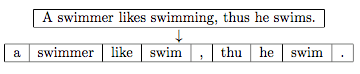
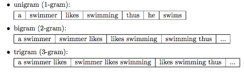

# DeftEval2020


<p align="center">
 Team members 🤟: <b>Nour El-Din Salah, Anas Hamed,</b> and <b>Wadie Bishoy</b>
</p>


# Motivation

Definition extraction has been a popular topic in NLP research for well more than a decade, but has been historically limited to well defined, structured, and narrow conditions. In reality, natural language is complicated, and complicated data requires both complex solutions and data that reflects that reality. The DEFT corpus expands on these cases to include term-definition pairs that cross sentence boundaries, lack explicit definitors, or definition-like verb phrases (e.g. *is*, *means*, *is defined as*, etc.), or appear in non-hypernym structures.


# Subtasks

DeftEval 2020 is part of SemEval 2020 official competition (Task 6). Organized by the Adobe Document Cloud Team. DeftEval is split into three subtasks,

- **Subtask 1: Sentence Classification**, Given a sentence, classify whether or not it contains a definition. This is the traditional definition extraction task.
- **Subtask 2: Sequence Labeling**, Label each token with BIO tags according to the corpus' tag specification.
- **Subtask 3: Relation Classification**, Given the tag sequence labels, label the relations between each tag according to the corpus' relation specification.


# Data Exploration


#### Data Format

```
[TOKEN] [SOURCE] [START_CHAR] [END_CHAR] [TAG] [TAG_ID] [ROOT_ID] [RELATION]
```

Where:

- **SOURCE** is the source .txt file of the excerpt
- **START_CHAR/END_CHAR** are char index boundaries of the token
- **TAG** is the label of the token (O if not a B-[TAG] or I-[TAG])
- **TAG_ID** is the ID associated with this TAG (0 if none)
- **ROOT_ID** is the ID associated with the root of this relation (-1 if no relation/O tag, 0 if root, and TAG_ID of root if not the root)
- **RELATION** is the relation tag of the token (0 if none).


#### Dataset Folder Structure 📁 (Original Github Repo)

- `deft_corpus\data\deft_files`: contains the dataset files itself. It has two splits divided into two subfolders:
  - `train`: For training split.
  - `dev`: For development split (used as testing data for evaluation when submitting on website in Training Phase).

- `deft_corpus\data\reference_files`: Are used in the Codalab pipeline for evaluation purposes. When you submit your predictions via Codalab, these are the exact files that the scoring program evaluates your submission against.
- `deft_corpus\data\source_txt`: The original sentences extracted from the textbooks used in the dataset. The source_txt has 80 files full of sentences for training and 68 files for development with less sentences per file. The deft_files have nearly the same files names as in source_text.
- `deft_corpus\task1_convertor.py`: This script is used to convert from the sequence/relation labeling format to classification format.This produces files in the following tab-delineated format: **[SENTENCE] [HAS_DEF]**. This is intended for Subtask 1: Sentence Classification.


# Data Pre-Processing Techniques

- **Removing stop words:** These are common words that don’t really add anything to the classification, such as a, able, either, else, ever and so on. So, for our purposes, The election was over would be election over and a very close game would be very close game.
- **Stemming:** Stemming describes the process of transforming a word into its root form. The original stemming algorithm was developed my Martin F. Porter in 1979 and is hence known as Porter stemmer.



- **Using n-grams:** In the n-gram model, a token can be defined as a sequence of n items. The simplest case is the so-called unigram (1-gram) where each word consists of exactly one word, letter, or symbol. Choosing the optimal number n depends on the language as well as the particular application.



---

### Testing Results 📉

| Algorithm           | F1-score class 0 | F1-score class 1 | Accuracy |
| ------------------- | :--------------: | :--------------: | :------: |
| Naive Bayes         |       0.80       |       0.63       |   0.74   |
| Decision Tree       |       0.82       |       0.62       |   0.75   |
| Logistic Regression |       0.85       |       0.66       |   0.80   |
| KNN                 |       0.82       |       0.30       |   0.71   |

---

### Resources 🔗

1. [*Weakly Supervised Definition Extraction (Luis Espinosa-Anke, Francesco Ronzano and Horacio Saggion), Proceedings of Recent Advances in Natural Language Processing, pages 176–185,Hissar, Bulgaria, Sep 7–9 2015.*](https://www.aclweb.org/anthology/R15-1025.pdf)

2. [*DEFT: A corpus for definition extraction in free- and semi-structured text, Sasha Spala, Nicholas A. Miller, Yiming Yang, Franck Dernoncourt, Carl Dockhorn*](https://www.aclweb.org/anthology/W19-4015/). [Check the Github Repo.](https://github.com/adobe-research/deft_corpus)
  
3. [*CodaLab DeftEval 2020 (SemEval 2020 - Task 6), Organized by sspala.*](https://competitions.codalab.org/competitions/20900#learn_the_details)

5. [*Document Embedding Techniques: A review of notable literature on the topic by Shay Palachy*](https://towardsdatascience.com/document-embedding-techniques-fed3e7a6a25d)
